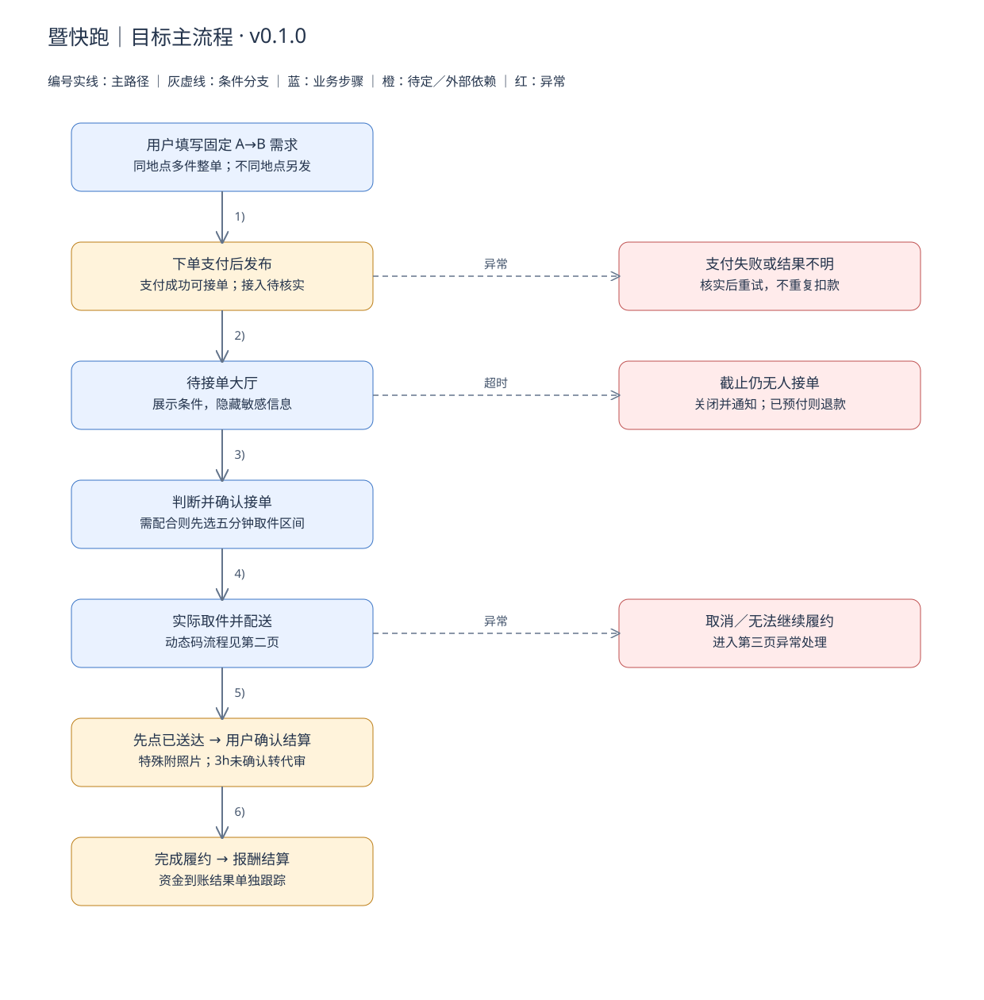
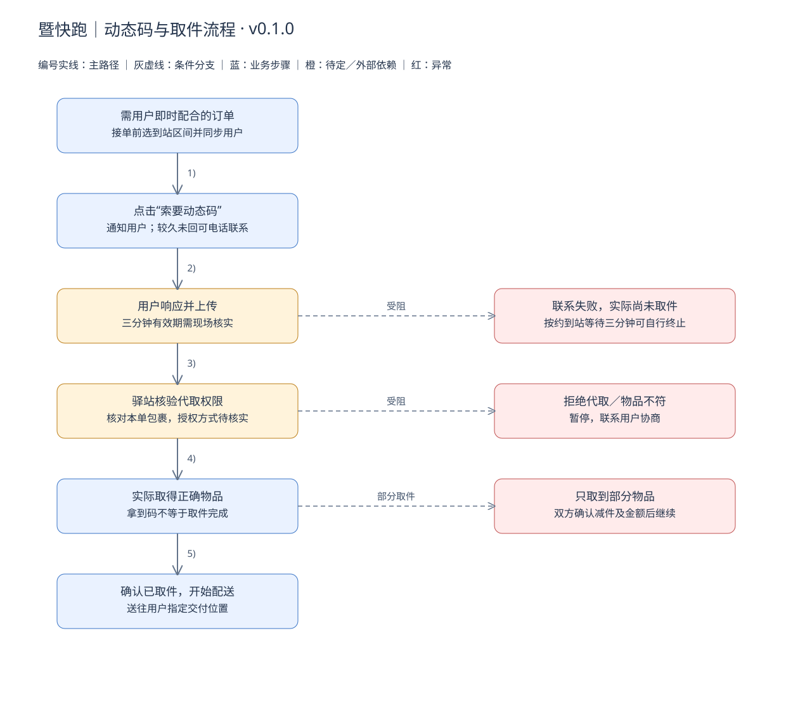
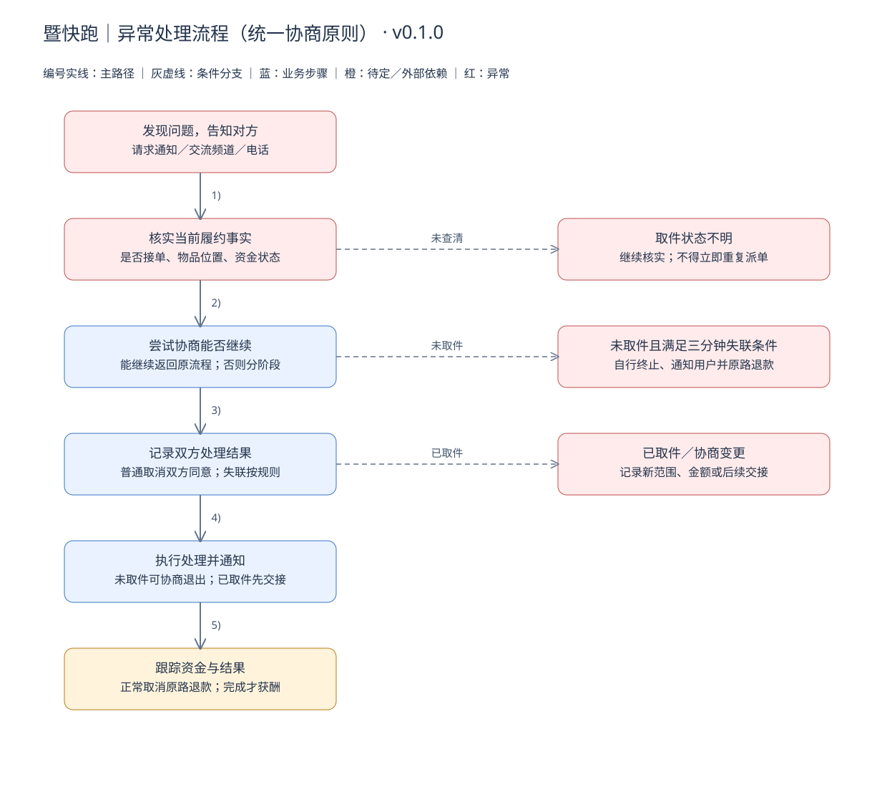

> 历史讨论底稿：保留拆分前全文，不再作为当前规则来源。请阅读 [业务文档](business-v0.1.0.md) 和 [产品需求与页面设计](requirements-v0.1.0.md)。文中旧版本、阶段性建议及待定口径仅用于追溯。

# 暨快跑业务需求文档

版本：0.1.0  
日期：2026-09-20  
产品暂定名：暨快跑  
项目工作目录：JIRUN  
状态：业务讨论基线；不作为已经定稿的开发或上线承诺。

## 1. 文档说明

本文记录目前讨论形成的业务目标、角色、规则、流程、异常和待决问题。先澄清业务，再通过少量真实交易验证，随后逐项确定基础功能与技术实现。

规则使用三种标记：

- **【已确认】**：发起人明确提出的业务方向；不等于市场或技术验证通过。
- **【建议】**：为补齐闭环提出的候选规则，尚未由发起人确认。
- **【待定】**：存在歧义、参数未定，或依赖外部能力核实。

流程图表达目标业务，其中橙色节点表示待定或外部依赖，红色表示异常处理，灰色虚线表示条件分支。图中文字带“建议”的环节不是既定规则。后续迭代以规则编号和待决编号追踪变更。

## 2. 背景、机会与目标

### 2.1 项目定位

产品名称：**暨快跑**（当前暂定名）。

产品说明：**校园取送平台｜自主报价，接单送达。**

宣传语：**顺路接一单，帮你送到手。**

利用学生已有的校园出行路线，将需要代取的人与顺路配送者连接起来，完成从快递站等取件点到寝室门口的最后一段配送。

当前主模式为：**用户填写固定 A→B 的需求并支付 → 顺路者选择并接单 → 取件 → 按约定交付 → 用户确认或满足条件后自动确认 → 获得报酬。** 配送者先发布行程不作为当前主流程。

**【已确认】顺路是项目出发点，是否接单由配送者自主判断。** 配送者综合路线、报酬、时间与自身安排决定是否接单；即使因报酬合适而专门出行，也属于有效交易。平台不核验原有行程、不区分“真实顺路”与“专程配送”，不另设专送业务或调度体系。接单即承诺履约，核心成功标准是在用户约定时间范围内，将正确物品交付至约定位置并按约定方式完成交接。不要求拆分找件、等码、上楼等额外耗时作为成功判定。遇到问题仍按通知、协商及分阶段异常规则处理，不因“顺路”而放宽接单后的约定。

### 2.2 已有观察与证据边界

| 观察 | 可支持的判断 | 不能据此认定 |
|---|---|---|
| 东门到教学楼，报价并实收 1 元 | 出现过一次真实付费代取 | 1 元是普遍可行价格 |
| 两个小件送到宿舍五楼，报价 5 元、实收 10 元，对方曾表示愿付 15 元 | 特定情境可能有较高支付意愿 | 大多数人愿付 10～15 元；熟人交易可直接外推 |
| 询问 3 位室友，其中 2 位表示愿意按 2 元/件帮取 | 存在口头供给信号 | 已有稳定配送者或可持续履约 |
| 部分受访者认为 1 元接受范围较广，经常外出者倾向自行取件 | 价格敏感和使用情境值得观察 | 校园整体支付意愿为 1 元 |
| 发起人报告：发布代取消息不到 20 分钟，有用户提出跨大半个校园搬送一把电竞椅；双方最终约定 10 元、交到楼下 | 明确发布服务后很快出现真实需求，双方能够议价达成接单约定 | 尚不能认定已交付或已收款，也不能据此推断稳定订单量或所有用户的价格上限 |

需求规模、价格交集、订单密度、重复使用、平台收益均未验证。用户此前提到约 2.2 万学生和 24 栋宿舍，作为待核实背景，不据此估算订单量或收入。

#### 案例 OBS-03：跨校园电竞椅搬送

| 项目 | 已知记录 |
|---|---|
| 需求来源 | 发起人发布代取消息后，不到 20 分钟收到询问（发起人口述） |
| 物品与路线 | 一把电竞椅，横跨大半个校园；具体 A／B 点未记录 |
| 交付条件 | 送到楼下，不要求上楼 |
| 议价过程 | 用户最初报价 8 元 → 配送者报价 12 元 → 用户提出 10 元 → 配送者接受 |
| 接单安排 | 发起人说明并非原本顺路，基于报酬决定接受；符合配送者自行判断是否接单的业务定位 |
| 当前结果 | 已按 10 元达成接单约定；实际取件、交付、收款和用户反馈尚未报告，待补充 |
| 可以支持的判断 | 小范围发布服务能引出具体需求；物品、距离和交付条件可以通过沟通形成双方接受的价格 |
| 证据边界 | 未将椅子明确归为大件或特大件；不能把谈成 10 元解释为 12 元绝对不可接受，或“所有帮拿超过 10 元都太贵” |

该案例构成继续推进初期测试的正向信号，但“收到需求并谈妥”与“成功交付并收款”分开记录。

### 2.3 阶段目标与约束

1. 验证有人在明确价格和条件下真实付款。
2. 验证非发起人配送者能够完成交易并愿意再次接单。
3. 观察发布的需求是否有人自主接单，以及接单后是否按用户约定时间完成交付。
4. 保留必要订单时间和异常记录，用于核对履约结果；不调查是否原本顺路，不拆分统计配送者的额外耗时。

发起人优先保证课程、实习与技术成长。可以偶尔体验履约，但业务不能依赖其长期跑腿、补单或持续催单。

## 3. 范围与角色

### 3.1 业务范围

| 范围 | 当前口径 |
|---|---|
| 【已确认】交付终点 | 下单时确定 B 点及交付方式：交到本人手中，或经授权放置指定位置并拍照；进入楼栋须具备通行条件 |
| 【已确认】物品类型 | 小件、中件、大件、特大件取送，以及外卖需求；按描述判断是否适合承接 |
| 【已确认】排除范围 | 洗衣机等不适合普通学生顺路携带的超大物品 |
| 【建议】首轮验证 | 东门驿站到 T9，固定晚间窗口、普通小件、限量测试 |
| 【已确认】物品描述与判断 | 用户选择小／中／大／特大，提供简短描述；平台给出建议性分类说明和参考价，配送者自主判断能否携带，明显大件可沟通协商，初期不建立精细重量尺寸模型。特大件档位不表示洗衣机等原排除物品自动纳入，具体分类示例待补充 |
| 【待定】外卖流程 | 具体取餐点、核验方式、食品洒漏及延误处理，另行验证 |
| 【待定】支付接入 | 目标是履约完成后结算；资金路径和服务商能力尚未确定 |
| 【建议】暂缓功能 | 自动路线优化、专送调度、钱包、复杂信用分、优惠券、全校推广 |

首轮只测小件是建议的实验范围，不表示删除中大件或外卖的产品方向。

### 3.2 参与角色

| 角色 | 职责与诉求 |
|---|---|
| 需求用户 | 注册后可下单；提供真实物品、地址、时间和报价并支付；按需配合取件；确认交付及查看订单历史 |
| 顺路配送者 | 判断携带能力、路线与时效；接单后取件交付；遇阻及时反馈；获得约定报酬 |
| 平台 | 展示需求、管理接单和状态、控制信息权限、通知超时、保留必要记录、协助异常处理 |
| 初期运营者 | 在有限投入内观察与核实异常；不默认承担替代配送职责 |
| 驿站／取餐点／宿舍管理方 | 决定代取及通行是否可行，属于外部依赖，平台不能单方面保证 |
| 支付服务方（待接入） | 在支持的业务与主体条件下处理支付、退款和结算 |

## 4. 核心业务规则

| 编号 | 状态 | 规则与说明 |
|---|---|---|
| BR-01 | 已确认 | 用户发布需求，填写物品类别、大小、件数、取送位置和时间要求。 |
| BR-02 | 已确认方向／价格暂定 | 平台提供按件参考价：小件 3 元、中件 5 元、大件 10 元、特大件 15 元；仅用于帮助用户报价，不是强制最低价或保证成交价。用户发布前可自主填写高于或低于参考价的报酬，配送者自行决定是否接受。替代此前平台规定起步门槛的设想；发布支付后的价格变更仍遵守 BR-23～26。 |
| BR-03 | 已确认＋待定 | 通常一件一单；同一 A 点、同一 B 点的多件可捆绑为一个订单，整单接取和交付，如三个小件。A 或 B 不同则分别发单。按件计价并显示总价；不同规格组合的单价填写方式待定。未经双方确认的部分交付不能按整单成功结算；双方协商减件后，以 BR-26 确认的新范围判断整单是否完成。 |
| BR-04 | 已确认 | 配送者确认有能力按要求送达后接单；可同时接多个订单。并发件数或订单上限待定。 |
| BR-05 | 已确认 | 接单后订单退出可接单大厅，由该配送者履约；这不是取消或删除订单。 |
| BR-06 | 已确认＋待定 | 无人接单时用户可加价，到接单截止时间关闭订单并通知用户；加价提醒策略后续确定。 |
| BR-07 | 已确认 | 默认接单截止为最迟送达前 15 分钟，用户可调整。初期不按实际距离计算余量，配送者自行判断能否履约。 |
| BR-08 | 已确认＋待定 | 未接单时用户可直接取消并原路退款。接单后一般由任一方申请、另一方明确同意后取消；正常未取件协商取消后原路退款，不支付配送报酬。BR-27 是明确例外：需要用户配合取件但联系失败、等待满三分钟仍未取件时，配送者可自行终止，无需再等用户同意或人工客服批准。已取件须先解决交接，不适用此例外。取消是关闭订单，不删除历史。 |
| BR-09 | 已确认＋待定 | 配送者无法履约应尽早告知；记录经核实的失约，由用户决定重新找人。平台不承诺一定替补成功。 |
| BR-10 | 已确认 | 完整接单后才可查看对应取件信息；不得在大厅公开取件码。 |
| BR-11 | 已确认＋待核实 | 发起人描述取件需用户上传三分钟有效的身份码。有效期、授权范围及代取接受方式需现场核实，不能当作所有驿站的通用规则。 |
| BR-12 | 已确认＋待定 | 用户下单时支付，支付成功后订单可被接取。只有整单成功配送后配送者才获得约定报酬；用户点击确认后立即触发结算，未确认则按 BR-19 的三小时自动确认规则处理。实际资金到账能力与支付接入方案待核实。 |
| BR-13 | 已确认意向＋待审查 | 初期不提供平台主动出资赔付承诺。不能将其解释为所有情况均免责；责任边界需结合实际服务与适用规则确定。 |
| BR-14 | 已确认 | 接单后保留服务范围、件数与报价快照；变更须双方确认，不能单方修改履约条件。电话协商可用于沟通，影响物品、金额、时间或交付方式的结果需回写订单并留下双方确认记录。 |
| BR-15 | 已确认 | 超过最迟送达时间不直接取消、退款或重新派单。配送者预计迟到应告知并协商新时间；用户同意则继续。未提前协商但用户最终收货并确认，也可结算并保留超时记录；用户不接受则走异常交接。按时完成与最终完成分别记录，初期不设自动罚款或迟到赔付。 |
| BR-16 | 已确认 | 异常统一遵循：发现问题 → 告知对方 → 尝试协商 → 能继续则返回原流程；不能继续则按未取件／已取件分别处理。联系不上时记录联系尝试，进入有上限的等待与异常处理，不把沉默视为同意。取件阶段用户无法联系的等待上限按 BR-27 执行；其他情形不套用该三分钟规则。 |
| BR-17 | 已确认 | 接单后允许提出交付变更，双方明确同意后生效。同一目的地当面交付改为放门口等轻微变更通常沿用原价；明显增加负担时另行协商价格及时间。未达成一致不单方更改原约定。指定位置放置需要留存交付照片。 |
| BR-18 | 已确认 | 配送者自行判断接单是否值得、能否完成，平台不验证是否真正顺路。接单后须履约；在用户约定时间内按约定位置和方式完成正确物品的交付，即为履约成功，结算仍按交付确认规则办理。 |
| BR-19 | 已确认 | 正常交付由用户点击确认收货，立即触发结算；不要求用户主动确认前另行走照片和倒计时流程。配送者已按约交付但用户未确认时，配送者留存必要交付凭证并点击“确认送达”，平台提醒用户并从此刻开始三小时计时。到期用户未确认、未提出异议且凭证符合约定时自动确认并结算。用户期间确认可提前结算；提出异议则停止自动结算并进入协商／争议处理，详见 5.4。 |
| BR-20 | 已确认 | 对需要用户即时配合的订单，配送者在确认接单前选择预计到达取件点的时间区间，接单成功时同步给用户。需要提供动态码、手机号验证等的快递或外卖适用；不需配合的订单不强制该步骤。依据实际取件方式判断，不对整个品类一概要求。 |
| BR-21 | 已确认 | 双方有可协商的交流频道；平台保留订单全流程业务记录，用户可查看自己的进行中、已完成、已取消等历史。取消申请、双方同意、变更、交付及支付退款结算结果均需可追溯，不因订单结束而删除。 |
| BR-22 | 已确认＋细节待定 | 注册用户可下单；申请成为配送者需提供学生证等基本信息。审核方式和具体材料待定。 |
| BR-23 | 已确认 | 双方可在订单过程中协商加价；配送者只能提出请求，由用户决定是否加价并支付差额。差额支付成功才计入订单报酬，未同意或未支付不改变原金额；配送者不得单方扣费。服务条件变更仍按 BR-17 双方确认。 |
| BR-24 | 已确认 | 未接单时用户可主动加价，普通改价只增加报酬，不支持自由降价或独立小费。支付差额期间原单暂不可接，成功后更新大厅价格，失败或放弃恢复原价；保留编号及调价记录。接单已先成功时转入已接单追加报酬，支付前明确告知当前配送者。加价不自动延期；超时关闭或取消后的迟到支付结果不得使订单重新可接，需核对差额并退款。 |
| BR-25 | 已确认 | 接单后配送者可获取本单用户电话号码，履约过程中双方可持续通过交流频道和电话协商。到取件点可点击“索要动态码”等操作通知用户；等待较久可电话联系。通知或拨号不等于用户已读、已接听或同意变更；只记录实际可确认的业务事件。 |
| BR-26 | 已确认需求／后续按需实现 | 双方可协商减少件数与报酬，例如三件六元改为两件四元，双方确认后记录新范围与金额、退回两元差额，两件全部送达后按四元结算。这是异常协商调整，不开放普通单方降价。功能可后续新增；上线前需明确如何记录双方确认、处理退差额和核对新约定，不能把聊天结果自动当成账务已变更。 |
| BR-27 | 已确认 | 需要用户即时提供动态码、验证等信息时，配送者按已告知的预计取件安排到站，发起请求并尝试联系失败后等待三分钟；用户仍未配合且实际尚未取件，配送者可自行终止交易。记录请求、联系尝试、计时及关闭原因，通知用户并原路退款，不支付配送报酬。该路径不要求对方再次同意或人工客服审核；符合条件时记为用户未及时配合，不算配送者主动失约。用户及时提供有效信息后继续履约，不能再以原失联原因终止。 |
| BR-28 | 已确认 | 下单可自愿指定联系不上时的备用交付位置和方式；配送者按明确授权放置、拍照并通知。无授权不得擅自放置；需协商其他交接或平台处理。不假定驿站可接收退回，也不自动要求配送者承担返回 A 点的新行程。 |
| BR-29 | 已确认 | 未接单改 A／B 点、件数或大小，初期采用取消退款后重下单；联系方式和必要备注可修改并留记录，但不得借备注改变核心服务条件。可显式调整时间，须保留有效的截止与送达关系，已截止订单不得直接恢复可接。此规则不影响接单后的双方协商变更。 |

### 4.1 参考价格与自主定价

| 物品档位 | 暂定参考单价 | 定价性质 |
|---|---|---|
| 小件 | 3 元／件 | 报价提示，用户可调整 |
| 中件 | 5 元／件 | 报价提示，用户可调整 |
| 大件 | 10 元／件 | 报价提示，用户可调整 |
| 特大件 | 15 元／件 | 报价提示，仍须确认适合携带及交付 |

参考价是当前产品假设，尚未经过足够交易验证，不标注为市场均价。实际报价以明确的 A→B、物品描述、件数、交付方式和时间要求为条件。上楼若已包含在约定 B 点，则包含在双方确认的报价中，不因展示参考价而另行自动收费。

发布前由用户自主报价，可低于或高于提示金额；无需设置此前讨论的统一 2 元起步门槛。配送者可以不接不合适的订单，平台不承诺参考价一定有人接。多件订单展示实际单价与整单总价。

这里的自主定价不改变既有交易规则：已发布且支付的订单，普通改价只支持加价并支付差额；不支持用户单方降价。接单后的异常减件与退差额须双方确认。参考价后续调整不改动既有订单的成交金额。

## 5. 业务流程图与说明

图源：[business-v0.1.0.drawio](diagrams/business-v0.1.0.drawio)。包含三页，可在 draw.io 中逐页编辑。SVG 为图源导出视图。

### 5.1 目标主流程

1. 用户填写固定 A 点、B 点、物品清单、单价与总价、交付方式、最迟送达时间，并说明是否需要即时配合取件。不同地点分别下单。
2. 下单时支付，成功后进入待接单大厅；支付失败不成为可接订单，恢复方式待定。
3. 配送者判断能否履约；需用户配合时先选择预计取件时间区间，再确认接单并同步给用户。不需即时配合则省略时间区间选择。接单后独占整单，冲突只能一方成功。
4. 配送者前往 A 点。需要配合时点击“索要动态码”等操作通知用户，较久未响应可用本单电话联系协商；不需要配合则直接按约定取件。预计时间变化时及时沟通，无需完整行程或持续定位。
5. 核对并实际取得整单物品后确认已取件，送往 B 点；部分取件先协商，可按 BR-26 双方确认减件并调整报酬，之后以新范围判断是否完成。
6. 按约定交到本人手中或放置指定位置，用户可直接确认收货。用户未确认时，配送者提供必要交付凭证并点击确认送达，平台通知用户并开始三小时计时；指定位置放置仍须用户授权及照片。
7. 用户确认即触发结算；已提交送达的订单满三小时仍未确认、无异议且凭证符合约定时自动确认并结算。异议订单转异常处理，不自动付款，边界见 5.4。业务完成与资金实际到账分别记录，所有阶段保留历史。

无人接单、取消、履约异常和争议均进入对应分支，不能强行走成功路径。

### 5.2 动态码与取件流程

本流程仅适用于实际需要用户配合的订单。配送者确认接单前选取预计到站区间，接单成功时同步给用户；其他无需配合的取件方式跳过此流程，直接取件。快递和外卖是重点场景，但不意味着每笔订单都需要动态验证。

1. 接单者到站后点击“索要动态码”，平台通知用户提供当前有效信息；较久未回复可电话协商，需其他验证时使用对应请求方式。
2. 用户在线响应并上传当前有效码；仅当前订单对应配送者可查看。
3. 按驿站实际规则核验身份或代取权限，同时核对订单对应包裹。
4. 实际拿到正确物品后确认取件。取得、展示或扫描码都不单独等于已取件。
5. 用户未响应时，配送者可电话联系协商；按约到站发起请求且联系失败后等待三分钟，仍未配合、实际未取件即可按 BR-27 自行终止。码过期但双方正在沟通时协商更新；驿站拒绝代取等其他问题不自动套用用户失联规则。

用户失联的现场等待上限已确定为三分钟；刷新次数及凭证保存期限仍待细化。身份码可能关联多个包裹，需要确认授权范围；平台无法自动撤回已被截图的码。

### 5.3 异常处理流程

**统一处理线【已确认】：发现问题 → 告知对方 → 尝试协商 → 能继续则返回原流程；不能继续则按未取件／已取件处理。**

这是下表各场景共用的原则，不要求每类意外建立独立调度流程：

- **未取件：**一般通过双方协商取消并原路退款；需要用户配合却联系失败、等待三分钟仍未取件时，配送者按 BR-27 自行终止并退款，不必先等人工核实。其他原因不自动认定为用户失联。
- **已取件：**先明确包裹的后续交接和费用，再结束订单；不能通过取消将包裹处置责任悬空。
- **取件状态不明：**先核实，不直接当作未取件重新派单。
- **对方不回应：**取件前需要用户提供信息的特定场景采用 BR-27 三分钟终止规则；已取件、取件状态不明或其他争议不直接套用。三分钟后的终止是预先约定的退出条件，不表示用户同意任何其他变更。
- **平台处理范围：**初期以双方沟通、明确规则与订单记录为主，不将人工客服或复杂争议处理能力作为当前基础使用的前提。尚未细化的争议保留在后续边界清单，不在本轮扩展完整客服流程；不承诺平台替补配送。

当前已有案例中，提前告知到站时间后用户均及时配合。先沿用这一正常配合方式，再观察陌生用户间的等待情况，不将失联预设为每单都会发生的问题。

异常处理以核实“是否接单、包裹在谁手中、资金处于什么状态”为起点。未知取件状态不能按未取件处理。

| 异常场景 | 当前处理方向 | 必须补齐的边界 |
|---|---|---|
| 截止仍无人接单 | 关闭订单并通知，用户决定是否自行取件；如已预付则退款 | 退款失败或延迟需单独跟踪 |
| 未接单时加价 | 用户支付差额成功后原单更新，保留编号和调价历史；失败保持原价 | 不延长时间、不降价、不另设小费；与接单同时发生时须保证金额一致，差额去向可追溯 |
| 取件前取消 | 未接单直接取消；已接单双方同意后取消并原路退款 | 不支付未完成配送的报酬；取件码已提供时仍须核实未取件 |
| 接单后无法前往 | 主动退出或超时提醒，核实后由用户选取消或重新发布 | 不能因一次超时直接判责或惩罚 |
| 取件状态不明 | 联系双方核实，不立即重复派单 | 核实期限、无人响应时的运营处理 |
| 大小与描述不符 | 暂停取件，重新确认能否携带及价格 | 不强迫接单者承担未约定工作 |
| 部分包裹取到 | 双方可确认减少件数及报酬，记录并退差额，剩余新约定全部交付后结算 | 调整功能后续按需实现；未同意时原约定有效，不能单方少送收全款 |
| 用户不提供信息且联系失败 | 按约到站请求、尝试联系失败后等待三分钟，仍未取件可自行终止并原路退款 | 不要求人工介入；已取件不得按此规则退出，用户已恢复有效配合则继续 |
| 取件码失效但用户可联系 | 协商重新提供有效码 | 不将正常沟通刷新等同于失联 |
| 已取件后要求取消 | 双方协商物品交接、费用；记录处理结果 | 双方同意取消不等于物品可以遗留或丢弃 |
| 超过最迟送达 | 标记超时并协商新时间；最终收货确认可结算，保留原时限和实际交付记录 | 不自动取消、退款或罚款；用户不接受时走异常交接 |
| 到门口联系不上 | 通知、电话联系；有明确备用授权则按约放置拍照，无授权则协商交接 | 不擅自放置；不默认驿站接受退回或要求配送者无条件返回 A 点 |
| 拿错／损坏／丢失 | 留存必要记录，协助核实责任与协商 | 不提供额外赔付承诺不能替代责任处理 |
| 报告送达但用户不确认 | 提交送达起三小时后，无异议且凭证符合约定才自动结算 | 当面交付未确认的有效凭证、争议解除后的处理仍待细化 |
| 结算或退款失败 | 保留应结算／应退款状态，跟进支付结果 | 不应把业务已完成等同资金已到账 |

### 5.4 交付确认、报酬控制与三小时规则

**已确认：用户掌握主动确认和加价的决定权，同时保留无异议超时自动结算作为例外。** 配送者不能自行加价或仅凭点击送达立即获得报酬。只有整单成功配送才支付配送报酬。

| 情况 | 确认与结算规则 |
|---|---|
| 正常交付，用户确认收货 | 立即触发结算；用户主动确认不以配送者先上传照片或先点击送达为前提 |
| 已按约交付，用户暂未确认 | 配送者留存必要凭证并点击确认送达；通知用户，从该时刻开始三小时计时 |
| 计时期间用户确认 | 立即触发结算，无需等满三小时 |
| 三小时到期 | 用户未确认、没有异议且交付凭证符合约定时自动确认并结算 |
| 用户提出未收到、位置不符等异议 | 停止自动结算，转入双方协商／平台争议处理；不能仅凭照片和超时直接付款 |
| 凭证不足或未实际完成交付 | 不能按无异议超时路径直接结算，需核实并补齐；凭证补充后如何计时待细化 |

指定位置放置应经用户授权，照片能对应本单物品和约定位置，并通知用户；不要求拍摄人脸或完整快递面单。当面交付优先请用户当场确认，未确认时保留交接沟通等证据，凭证不足不得自动结算。暂不新增收货确认码。具体凭证核验标准仍需细化。“已到达 B 点”不等于已完成交付；用户明确表示没有收到属于异议，与忘记点击确认不同。

双方在取件和交付过程中均可沟通。若物品大小等情况需要重新协商报酬，配送者提出请求，由用户决定是否点击加价并支付差额；用户未接受时不改变原订单金额。用户付款不代表允许单方改变配送地点、物品或时间，服务条件变更仍须双方同意。未能达成一致则按统一异常规则处理。

“确认后立即到账”是产品目标；业务上确认后立即发起结算，实际资金到账时效仍需核实支付方案。争议解除后恢复计时还是直接按处理结果结算，以及补充凭证是否重新计时，暂留待定。

### 5.5 协商是贯穿订单的基础能力

核心方式：**通知或请求 → 交流频道／电话协商 → 双方确认结果 → 更新必要订单记录 → 继续交付或处理异常。** 无需为每种意外都先开发独立功能。

基础能力包括本单联系方式、动态码请求通知、交流入口和已有加价／取消操作。减少件数和退差额属于已经认可的业务需求，可在实际需要时增加专门操作；未实现前不宣称系统支持自动减件退款。正常加价仍只允许用户增加报酬，不能据此推导出任何一方可随意降价。

示例：原订单三个小件、每件两元；到站发现只能取两件 → 配送者联系用户 → 双方确认本次两件、共四元 → 留存原约定和新约定、退回两元差额 → 两件全部交付 → 用户确认或满足自动确认条件后结算四元。用户未同意则不改变原订单，不将已取两件直接算作三件完成。退差额处理结果独立记录，不能假定发起退款就已到账。

平台能记录请求、通知发送、订单内消息、双方确认和实际支付处理结果；普通电话交流内容不会天然进入平台，影响履约和金额的结果需双方确认回写。沉默、电话未接或单方陈述都不等于协议变更。

### 5.6 取件配合超时的简化退出规则

正常路线：预计取件时间已告知用户 → 配送者按约到站 → 点击索要动态码等请求 → 用户提供有效信息 → 继续取件。

失联路线：到站请求并尝试联系失败 → 等待三分钟 → 仍无法取得所需信息且实际未取件 → 配送者自行终止 → 通知用户、关闭订单、原路退款并保留历史。配送者无需无限等待，不依赖人工客服；未成功配送不获得报酬。

三分钟不从接单时开始，也不能在预计取件安排之前提前到站催码并据此认定用户未配合。若用户在期间提供有效信息，继续取件；未到站、已实际取件或只是单纯超出预计时间，不直接构成这条退出条件。此处只划清该规则的适用范围，不引入实时定位或新的人工审核要求。

本规则替代此前“取件前失联只能结束现场等待、订单仍需人工核实才能关闭”的建议。其他争议能力暂不扩展，当前文档不将尚未设计的人工客服当成已经可用的能力。

## 6. 订单与资金状态口径（建议模型）

此节用于统一业务语言，不预设数据库设计。业务进度、异常标记和资金状态分别记录，避免一个“取消”同时代表多种情况。

### 6.1 正常履约与关闭

正常路径：**待发布 → 待接单 → 已接单／待取件 → 已取件／配送中 → 已报告送达／待确认 → 已完成。**

| 当前阶段 | 事件与条件 | 结果 |
|---|---|---|
| 待发布 | 需求齐全且下单支付成功 | 待接单 |
| 待接单 | 接单成功且未超接单截止 | 已接单；从可接单大厅移除 |
| 待接单 | 用户取消或接单截止无人接单 | 已关闭；注明原因，启动原路退款 |
| 已接单 | 配送者实际取到正确物品并确认 | 已取件／配送中 |
| 已接单／待取件 | 需要用户配合但联系失败，满足 BR-27 三分钟条件且未取件 | 配送者自行终止，关闭并原路退款；记录原因，不支付配送报酬 |
| 已接单 | 一方申请取消 | 进入取消申请待回应；另一方同意且确认未取件后关闭并原路退款；拒绝或失联走异常处理 |
| 配送中 | 配送者已实际交付，用户直接确认收货 | 已完成；立即触发结算，无需先等照片或倒计时 |
| 配送中 | 用户未确认，配送者提交送达及必要凭证 | 待用户确认；提醒用户并开始三小时计时，不单凭报告立即结算 |
| 待确认 | 用户确认，或满足 BR-19 的三小时凭证自动确认规则 | 已完成；触发结算 |
| 已取件之后 | 双方请求结束履约 | 先明确物品交接与费用，协商结案 |

“待核实、超时、争议”作为附加处理状态保留原履约进度。恢复、关闭、重新发布均需要记录依据，不能清空历史。

### 6.2 资金状态

目标预付模式：**未支付 → 支付处理中 → 已支付／待结算 → 结算处理中 → 已结算**。

退款分支：**符合退款条件 → 退款处理中 → 已退款**；支付、结算和退款均可能失败或结果暂不明确，需要核查，避免重复扣付。

上述是产品目标，不代表资金会进入平台自有账户。实际账户结构与回调能力以核实后的支付服务方案为准。结算前存在交付异议时停止自动结算；争议解除后的资金处理和结算后申诉流程仍待定。

## 7. 信息与权限需求

| 信息 | 大厅可见 | 接单后 | 说明 |
|---|---|---|---|
| 类型、大小、件数、价格、截止与送达时间 | 是 | 是 | 用于判断能否履约 |
| 取件点、目的楼栋、必要楼层及通行限制 | 是，按最小必要展示 | 是 | 精确寝室号不需在大厅公开 |
| 精确地址、联系电话与交流渠道 | 否 | 本单相关双方；配送者可获取用户电话联系 | 不向大厅公开，配送完成后的保留期限待定 |
| 取件码、动态身份码 | 否 | 仅对应接单者，建议按需提供 | 不写入普通日志或公开记录表 |
| 订单历史、异常及交接证据 | 否 | 双方按权限查看 | 运营访问需限定用途和范围 |
| 支付记录 | 否 | 查看自身必要信息 | 不公开金融账户敏感信息 |

核心记录：订单编号、角色标识、固定 A／B 点、物品清单与总价、交付方式、是否需要即时配合、预计取件区间、条件快照、报价与协商变更、接单／取件／送达／确认时间、取消申请与双方回应、交付凭证、异常及支付退款结算结果。用户可查看自己全部订单状态和历史。订单关闭不删除记录；这里的完整记录指业务过程可追溯，不意味着永久保留已失效的动态码等敏感凭证，具体保存期限仍待定。

## 8. 基础功能候选与实施顺序

| 优先阶段 | 需求 | 对应规则／问题 |
|---|---|---|
| 人工验证 | 发布模板、明确报价、接单确认、私下传递取件信息、交付确认、观察记录 | BR-01～11；先验证交易发生 |
| 基础 MVP | 身份与角色识别、需求发布、任务大厅、订单详情、独占接单、我的订单、多单列表 | BR-01～05、信息权限 |
| 基础 MVP | 小／中／大／特大参考价提示、发布前自主报价、件数及总价展示 | BR-02～03；参考价不作强制最低价或自动附加收费 |
| 基础 MVP | 履约状态更新、取件信息受控展示、取消与异常入口、必要通知、操作记录 | BR-08～11、BR-15 |
| 基础 MVP | 本单电话号码与联系入口、“索要动态码”等通知、取件前联系失败三分钟自行终止及退款、自愿备用交付授权 | BR-25、BR-27～28；无需人工客服批准该终止路径 |
| 基础 MVP | 接单截止关闭、用户加价、最迟送达超时提醒 | BR-06～07；通知渠道待定 |
| 基础 MVP | 未接单原单加价、支付差额后更新大厅、调价历史、加价与接单冲突时的金额一致性 | BR-24；不支持降价，不另设小费，不自动延长时间 |
| 基础 MVP | 同 A→B 多件整单、按需选择预计取件区间并通知用户、双方交流频道、取消申请及同意、照片凭证、三小时条件确认、历史订单查询 | BR-03、BR-08、BR-19～22；需同步完成结算与争议规则 |
| 预付上线前必须完成 | 支付服务核实、预付、补差额、退款、结算、争议与失败处理 | BR-12；不能用假余额替代真实资金闭环 |
| 后续迭代 | 加价建议、路线推荐、容量限制优化、信用与违规策略 | 依据真实数据，不预设复杂算法 |
| 后续按需实现 | 双方确认的异常减件、报酬调整与退差额；保留新旧约定 | BR-26；业务需求已认可，功能不强制加入第一版 |

人工试验若采用交付后直接结算，应明确告知参与者，并单独标记数据；不能宣称已验证平台预付模式。

业务验收场景：两人同时接一单只有一人成功；截止与接单同时发生有唯一结果；接单后不再出现在可接大厅；码不向无关用户泄露；未实际取件不进入配送中；超时不自动重复派单；送达报告与交付确认分开；关闭、退款和结算结果可追踪。

## 9. 初期验证与观察记录

建议路径：**澄清首轮规则 → 你偶尔体验 → 非本人配送者履约 → 少量人工撮合 → 明确软件化瓶颈 → MVP。** 不要求先开发再找用户。

每笔意向和交易记录：

| 类别 | 字段 |
|---|---|
| 场景 | 日期、路线、时段、物品类别／大小／件数、送达位置、需要代取的原因 |
| 报价 | 初始报价、最终单价与总价、报价变动、支付是否真实发生、结算模式 |
| 接单 | 发布时间、接单时间、是否由发起人履约；不要求说明原有行程或接单动机 |
| 履约 | 用户约定送达时间、实际交付时间、约定交付方式、交付确认结果 |
| 结果 | 是否成交、关闭／异常原因、是否按时交付、再次使用或接单的实际行为 |

核心观察指标：发布订单数、接单数、按约定时间完成交付的订单数，以及未接单／未完成原因。履约是否成功按 BR-18 判断，不增加“必须真实顺路”或“额外耗时足够少”的门槛。后续需要时再观察重复使用和平台运营负担，不将复杂统计作为初期必备流程。每次统计注明分母和服务条件，不把口头意愿计为成交。

进入 MVP 的证据：非发起人可以反复履约；明确条件下出现真实付款；人工流程有重复且可减少的负担。没有统一的样本数通过线；若价格长期无交集、时空无法匹配或运营负担超限，应调整或暂停。

## 10. 待澄清事项与迭代顺序

| 编号 | 待决问题 | 建议解决节点 |
|---|---|---|
| Q-01 | 已改为非强制按件参考价：小 3／中 5／大 10／特大 15 元；用户自主报价，不设此前统一起步门槛 | 定价方向已明确，数值后续按实际反馈迭代 |
| Q-02 | 已明确同 A→B 多件整单及双方协商减件退差额；剩余：不同规格报价、调整功能上线顺序和未实现时的操作方式 | 对应功能实现前 |
| Q-03 | 已明确小／中／大／特大加简短描述和参考价；剩余为分类示例与特大件服务边界，不展开复杂尺寸模型 | 填写交互时补齐 |
| Q-04 | 已明确默认提前 15 分钟截止接单、用户可调；需配合的订单接单前选预计取件区间并同步用户 | 已明确方向；后续细化填写交互 |
| Q-05 | 发起人确认可以代取，部分需动态码；宿舍楼可能限制进入，由发起人后续了解。动态码具体操作仍以现场为准 | 宿舍权限待核实 |
| Q-06 | 已明确请求通知、电话协商，以及按约到站联系失败后三分钟未取件可自行终止；剩余为计时展示与操作记录细节 | 核心规则已确定 |
| Q-07 | 三分钟取件前失联可直接终止；已取件先交接、备用放置须授权。其他争议和人工客服能力暂缓细化 | 后续按实际需要迭代 |
| Q-08 | 已明确用户主动确认、提交送达起三小时计时、无异议且凭证合格才自动结算；剩余：当面交付未确认的有效凭证、争议解除后的结算处理 | 自动结算上线前 |
| Q-09 | 支付服务可否支持主体与业务？发布预付、补差额、退款、结算如何实现？ | 接入真实平台预付前 |
| Q-10 | 平台、用户、配送者责任如何界定，采用什么告知条款？ | 对外试验前明确基本规则；公开上线前审查 |
| Q-11 | 已明确注册可下单、配送者需学生证等资料；具体审核方式保留待定，多单容量及完整客服处理能力暂不展开 | 后续按实际需要迭代 |
| Q-12 | 是否抽成、收费方式及能否覆盖运营和支付成本？ | 稳定交易后测算；0.1.0 不承诺盈利 |
| Q-13 | 取件信息、身份信息、交接证据保存多久？运营访问如何控制？ | 软件收集信息前 |

建议 v0.1.1 优先补齐 Q-02、Q-03、Q-05、Q-08 中尚未明确的必要细节；Q-01 的定价方向已更新，参考价数值随真实反馈迭代。完成实地核实与少量交易后，再修订状态、异常和 MVP 范围。

## 11. 外部依赖与责任说明

本节记录需核实的上线依赖，不替代针对实际经营方案的专业审查。

- 用户“预付、完成后给配送者”的需求是目标；不能默认使用平台或个人账户收款后自行转付就满足支付业务要求。资金处理方案需结合支付服务能力与适用规则确定。参考：[中国人民银行《非银行支付机构监督管理条例》](https://www.pbc.gov.cn/tiaofasi/144941/144953/5174993/index.html)。
- “不提供平台主动赔付保障”不等于“平台所有责任均可免除”。格式条款涉及提示说明、公平性与效力边界。参考：[《民法典》第四百九十六、四百九十七条](https://www.cac.gov.cn/2020-06/01/c_15925617772683192.htm)。
- 校园通行、驿站授权和三分钟身份码均依赖实际场所规则，未核实前不对用户承诺必然可取。

## 12. 版本与维护

命名更新：产品暂定名确定为“暨快跑”，同步 README、业务文档及流程图标题；文档仍为 v0.1.0，项目工作目录保留 `JIRUN`。

| 版本 | 日期 | 变更 |
|---|---|---|
| 0.1.0 | 2026-09-20 | 建立业务基线；记录证据、角色、规则、主流程、取件流程、异常、状态、基础需求与待决项 |
| 0.1.0 讨论补充 | 2026-09-20 | 确认顺路服务边界、统一异常处理线和双方协商变更原则；补充预计取件时间的沟通方式。未确定的等待时限与费用继续保留待定。 |
| 0.1.0 口径修正 | 2026-09-20 | 明确是否顺路由配送者自行判断；删除真实顺路核验和额外耗时拆分要求。以自主接单、接单后按约定时间交付为核心；此口径替代此前对专程配送成交的排除。 |
| 0.1.0 交易闭环补充 | 2026-09-20 | 确认固定 A→B 多件整单、下单支付、正常取消原路退款、接单后双方同意取消、整单完成才获报酬、用户确认及三小时凭证自动确认、按需预计取件区间、交流与历史记录。三小时起算和争议例外仍待定。 |

本轮补充：确认用户主动确认与无异议三小时自动结算并存；计时从配送者提交送达开始，异议停止自动付款；明确用户决定并支付协商加价，正常用户确认不强制先走照片流程。此口径替代此前对三小时起算点和争议暂停的待定表述。

加价规则定稿：新增 BR-24，未接单时采用原单加价、支付差额后生效；保留订单编号及调价记录，不降价、不另设小费、不自动延期。主流程保持不变，此操作发生在待接单阶段。

协商边界补充：新增 BR-25～29；确认电话号码和动态码请求通知为基础配合能力，异常减件退差额为后续按需实现需求。接受有限等待与订单关闭分开、迟到与最终完成分开、备用交付须授权、交付凭证边界、加价期间暂不可接和未接单编辑范围。此处的双方异常减价是普通单方“不支持降价”规则的明确例外。

本轮范围简化：小／中／大加描述，由配送者自主判断；代取可行，宿舍通行待发起人核实；取件前联系失败三分钟可自行终止并退款，替代此前需人工核实才能关闭的流程。暂不展开人工客服和更多特殊边界。

迭代时记录：关联 BR／Q 编号、原规则、新规则、理由／证据、对流程与资金处理的影响。更新文档时同步更新受影响的图页。`.drawio` 为可编辑图源，SVG 从图源导出，避免图文含义不一致。

需求案例与定价更新：新增 OBS-03 电竞椅搬送案例，记录消息发布不到 20 分钟出现需求及 8→12→10 元议价，状态为已谈妥、交付和收款待补。BR-02 改为小／中／大／特大每件 3／5／10／15 元的暂定参考价，用户自主报价，替代此前平台起步价设想。主流程保持不变。
